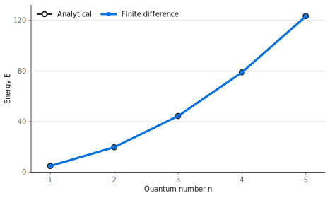
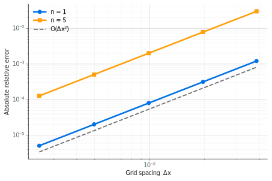

<link rel="stylesheet" href="../assets/katex-local.css">

FINITE DIFFERENCE · DISCRETIZATION

# 空间离散后，薛定谔方程成为 **100×100** 矩阵本征值问题。

01 · 连续问题与边界

$$
-\frac{\hbar^2}{2m}\frac{\mathrm d^2\psi}{\mathrm dx^2}
+V(x)\psi=E\psi,\qquad \hbar=m=1
$$

$$
\psi(0)=\psi(L)=0,\quad
x_i=i\Delta x,\quad
\Delta x=\frac{L}{N+1}=\frac{1}{101}
$$

02 · 中心差分

$$
\left.\frac{\mathrm d^2\psi}{\mathrm dx^2}\right|_{x_i}
\approx
\frac{\psi_{i+1}-2\psi_i+\psi_{i-1}}{\Delta x^2}
$$

$$
-\frac{\psi_{i-1}}{2\Delta x^2}
+\left(\frac{1}{\Delta x^2}+V_i\right)\psi_i
-\frac{\psi_{i+1}}{2\Delta x^2}
=E\psi_i
$$

每个网格点只与左右相邻点耦合，因此矩阵天然是三对角结构。

03 · HAMILTONIAN MATRIX

<strong>无限深势阱内部</strong>　$V_i=0$

  
主对角元<strong>$1/\Delta x^2=10201$</strong>

  
相邻对角元<strong>$-1/(2\Delta x^2)=-5100.5$</strong>

$$
H=
\begin{bmatrix}
10201 & -5100.5 & 0 & \cdots & 0\\
-5100.5 & 10201 & -5100.5 & \cdots & 0\\
0 & -5100.5 & 10201 & \ddots & \vdots\\
\vdots & \vdots & \ddots & \ddots & -5100.5\\
0 & 0 & \cdots & -5100.5 & 10201
\end{bmatrix}
$$

  
$$H\boldsymbol{\psi}=E\boldsymbol{\psi}$$

  
<strong>本征值 $E$：允许能量</strong> 本征向量 $\boldsymbol{\psi}$：离散波函数

<!--
讲解顺序：先说明 N=100 指 100 个内部未知点，所以 Δx=1/101；再从中心差分落到单点离散方程。最后指出每一行只有三个非零系数，因此形成三对角矩阵。差分法把允许能量变成矩阵本征值，把波函数变成矩阵本征向量。
-->

---

EIGENVALUE VALIDATION

# 没有代入解析能量公式，矩阵仍复现了最低五个能级。

能量随量子数增长

  

两条曲线在能量尺度上几乎重合，但差分结果始终略低。

<table class="result-table">
  <thead>
    <tr><th>$n$</th><th>差分解</th><th>解析解</th><th>相对误差</th></tr>
  </thead>
  <tbody>
    <tr><td>1</td><td>4.934404</td><td>4.934802</td><td>−0.00806%</td></tr>
    <tr><td>2</td><td>19.732844</td><td>19.739209</td><td>−0.03225%</td></tr>
    <tr><td>3</td><td>44.381001</td><td>44.413220</td><td>−0.07254%</td></tr>
    <tr><td>4</td><td>78.855032</td><td>78.956835</td><td>−0.12894%</td></tr>
    <tr><td>5</td><td>123.121584</td><td>123.370055</td><td>−0.20140%</td></tr>
  </tbody>
</table>

$$E_n=\frac{n^2\pi^2}{2L^2}$$

<strong>解析公式只用于计算完成后的验证</strong>

eigh_tridiagonal(..., select_range=(0, 4)) → 只求最低五个本征值

<!--
这一页先强调数值求解没有使用解析能量公式。矩阵求解器只读取主对角和次对角数组，并返回最低五个本征值。解析公式在最后才用于核对。所有数值值略低于解析值，而且误差随 n 增大。
-->

---

ERROR & CONVERGENCE

# 离散误差按 **$\Delta x^2$** 收敛，但高能级会放大误差。

误差从哪里来？

中心差分不等于真实二阶导数，而是泰勒展开的二阶近似：

$$
\frac{\psi_{i+1}-2\psi_i+\psi_{i-1}}{\Delta x^2}
=
\psi''(x_i)
+\frac{\Delta x^2}{12}\psi^{(4)}(x_i)
+O(\Delta x^4)
$$

  
<small>主误差阶</small><strong>$O(\Delta x^2)$</strong>

  
$N$ 近似加倍　→　$\Delta x$ 减半　→　误差约降为 $1/4$

无限深势阱的离散能级

$$
E_n^{\mathrm{FD}}
=\frac{2}{\Delta x^2}
\sin^2\!\left(\frac{n\pi}{2(N+1)}\right)
$$

$$
\frac{E_n^{\mathrm{FD}}-E_n}{E_n}
\approx
-\frac{n^2\pi^2}{12L^2}\Delta x^2
$$

  负号：差分能量略低于解析值
  $n^2$：高能级误差更容易放大

真实计算的双对数收敛图

同一 $\Delta x$ 下，$n=5$ 的误差始终更大：高能级波函数振荡更快，有限网格更难准确描述其曲率。

<!--
中心差分的主误差来自 Δx² 项，所以网格加倍时误差大约下降到四分之一。右侧是 N=25、50、100、200、400 的真实结果。两条曲线都与二阶参考线平行；同时 n=5 始终高于 n=1，说明高能级振荡更快，对网格分辨率要求更高。
-->
